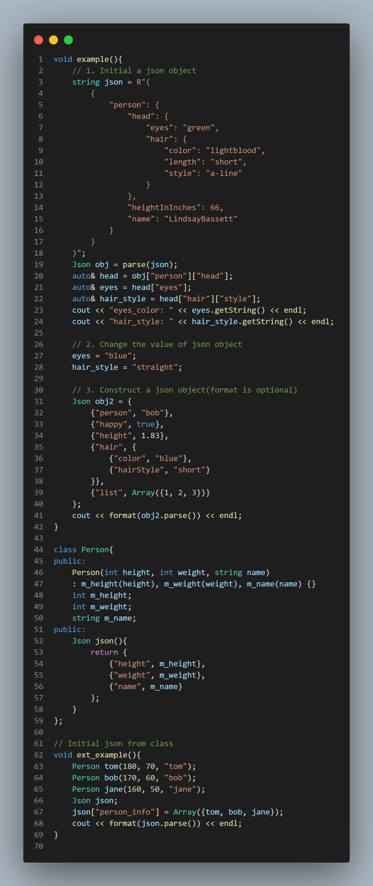
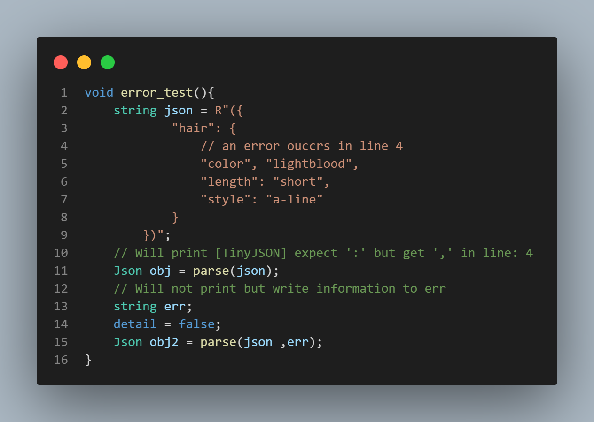
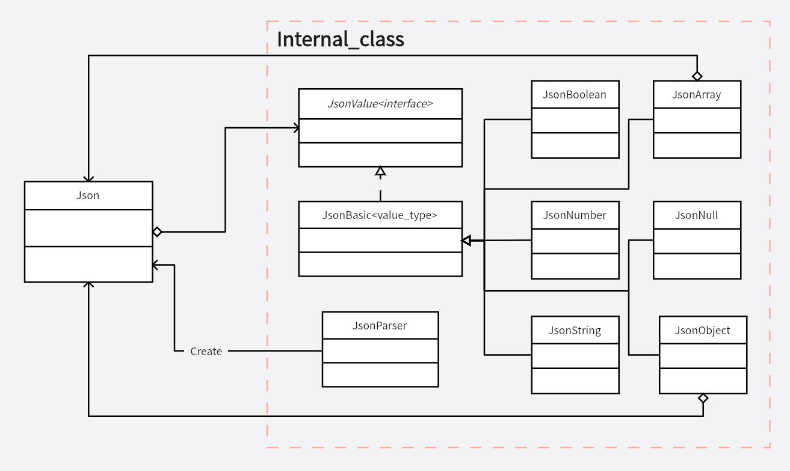

# Tiny-JSON
   

### Introduction
Tiny-JSON is a light-weight JSON/JSON5 liberary implemented by C++11. The coding style refers to Google C++ Style Guide, only need includes head file to import, and has no third party dependency.

[中文版本](https://github.com/Syan-Lin/Tiny-JSON/blob/main/README.md)

### Features
- Read JSON file
- Generate JSON file
- Support JSON5
- Extremly easy used
- Highly readable code
- Detailed error message

### How to use
Only includes `tiny_json.h` to your project, a compiler above 'c++11' is required.

### Examples
Compiler version: `gcc version 8.1.0 (x86_64-posix-seh-rev0)`



>More examples in `example.cpp` and `Tests/class_test.cpp`

### Error prompt
Print colorful text in console in Windows and Linux is supported, with `tiny_json::detail` to set whether need to print error message.

Another way to get error message is through `tiny_json::parse(json, error)`, the error messege will write to second parameter.



>More error prompt in `unit_test.cpp`, and set `detail` to `true` in line 33 to show.

### Tests
#### Unit test
This part includes third party `doctest`, only test files need this liberary.

Test coverage reaches 100% in core functions and classes.
```
[doctest] doctest version is "2.4.9"
[doctest] run with "--help" for options
===============================================================================
[doctest] test cases:  11 |  11 passed | 0 failed | 0 skipped
[doctest] assertions: 376 | 376 passed | 0 failed |
[doctest] Status: SUCCESS!
```
#### Performance tests
A simple performance test frame is defined in `tiny_json_performance.h`, which could set the scale of types separately to see its actual performance.

Test result: The result is related to the data distribution and the performance of the CPU.
- Generate JSON string reaches 117 MB/s
- Parse JSON string reaches 107 MB/s

>Tested in i5-12600KF, single thread, compile option `-O3`

Test cases defined below:
- Null: `"#nullx": null`
- Array: `"#arrayx": [1, "string", true, null]`
- Object: `"#objectx": {{"number", 1}, {"string", "hello"}, {"bool", false}, {"null", null}}`
- String: `"#stringx": "Hello World!"`
- Number: `"#numberx": "31415"`
- Boolean: `"#boolx": true`
```
[===============================================================]
[--------------- Run tiny_json performance test ----------------]
[----------------------- Write benchmark -----------------------]
|     Null  |  Array  |  Object |  String | Number  | Boolean   |
[---------------- Scale of types in one object -----------------]
|    10000  |  10000  |  10000  |  10000  |  10000  |  10000    |
[----------------------- Write JSON (ms) -----------------------]
|                    str_size: 1873 KB, 16ms                    |
[===============================================================]

[===============================================================]
[--------------- Run tiny_json performance test ----------------]
[----------------------- Read benchmark ------------------------]
|     Null  |  Array  |  Object |  String | Number  | Boolean   |
[---------------- Scale of types in one object -----------------]
|    10000  |  10000  |  10000  |  10000  |  10000  |  10000    |
[------------------------ Read JSON (ms) -----------------------]
|                    str_size: 1873 KB, 28ms                    |
[===============================================================]

[===============================================================]
[--------------- Run tiny_json performance test ----------------]
[---------------------- Class benchmark ------------------------]
|     Null  |  Array  |  Object |  String | Number  | Boolean   |
[---------------- Scale of types in one object -----------------]
|    100000 |  100000 |  100000 |  100000 |  100000 |  100000   |
[--------------------- Construct time (ms) ---------------------]
|    26     |  53     |  74     |  30     |  28     |  26       |
[--------------------- Destruct time (ms) ----------------------]
|    34     |  47     |  46     |  26     |  29     |  21       |
[===============================================================]

[===============================================================]
[--------------- Run tiny_json performance test ----------------]
|     Null  |  Array  |  Object |  String | Number  | Boolean   |
[---------------- Scale of types in one object -----------------]
|    10     |  20     |  50     |  50     |  20     |  10       |
[---------------------------- Loops ----------------------------]
|                             10000                             |
[--------------------- Construct time (ms) ---------------------]
[--------------------- Includes write JSON ---------------------]
|                      str_size: 5 KB, 901                      |
[===============================================================]

json_size(Json/twitter.json): 631 KB
time: 8ms
json_size(Json/canada.json): 2251 KB
time: 110ms
json_size(Json/citm_catalog.json): 1727 KB
time: 16ms
```

### UML Diagram

