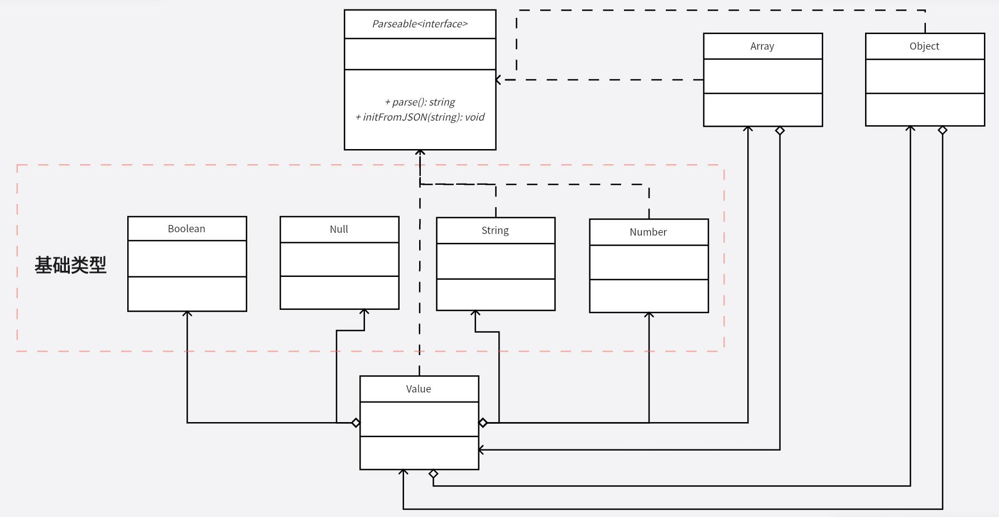

# Tiny-JSON
   

### 介绍
Tiny-JSON 是一个用 C++11 实现的轻量化 JSON 解析和生成器（支持 JSON5），编码风格参考了 C++ 谷歌命名规范，无第三方库依赖，只依赖于标准库。

### Features
- 读取 JSON 文件，解析成 C++ 对象
- 使用 C++ 对象生成 JSON 文件
- 支持 JSON5
- 极简的用法

### 示例
编译器版本：`gcc version 8.1.0 (x86_64-posix-seh-rev0)`

```cpp
using namespace tiny_json;

// 1. 读取 JSON 并转化为 C++ 对象
string json = R"({
        "integer": 1,
        "string": "Hello World!",
        "array": [
            1.2,
            "string",
            false
        ]
        })";
Object obj = parse(json);

int integer = obj["integer"].get<int>();
string str = obj["string"].get<string>();
double first = obj["array"][0].get<double>();
string second = obj["array"][1].get<string>();
bool third = obj["array"][2].get<bool>();
obj["array"][2] = "change to string";

// 2. 使用 C++ 对象生成 JSON 文件
Object obj2 = {
    {"number", 5.2},
    {"string", "Hello World!"},
    {"bool", false},
    {"array", Array({1, false, "abc"})}
};
// 生成 JSON 字符串
string json2 = parse(obj2);
```

>更多示例请看 `tiny_json_example.cpp` 和 `tiny_json_test.cpp`

### UML 图


### TODO
- [x] JSON5 完全支持
