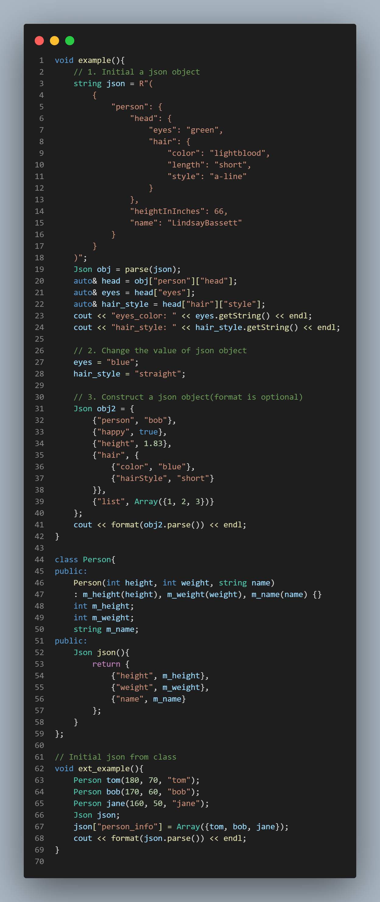
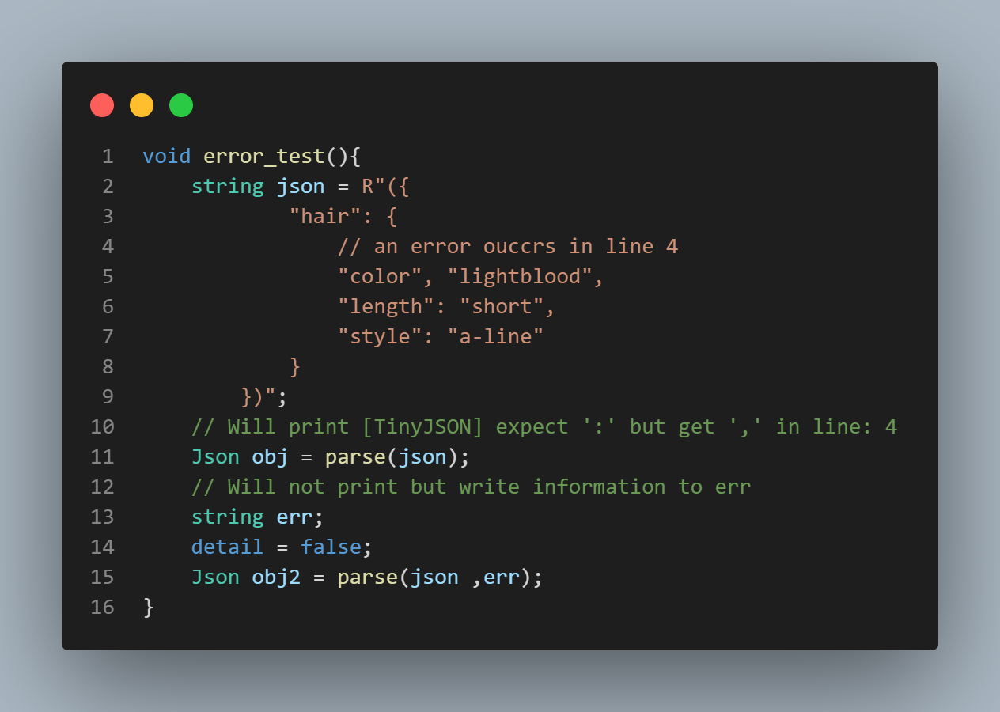

# Tiny-JSON
   

### 介绍
Tiny-JSON 是一个用 C++11 实现的轻量级 JSON/JSON5 库，编码风格参考了 C++ 谷歌命名规范，导入只需引入头文件，无第三方库依赖。

[English version](https://github.com/Syan-Lin/Tiny-JSON/blob/main/README-en.md)

### Features
- 读取 JSON 文件
- 生成 JSON 文件
- 支持 JSON5
- 极简的用法
- 代码可读性高
- 详尽的错误信息

### 如何使用
只需要引入 `tiny_json.h` 到你的工程中，需要 `c++11` 以上版本的编译器

### 示例
编译器版本：`gcc version 8.1.0 (x86_64-posix-seh-rev0)`



>更多示例请看 `example.cpp` 和 `Tests/class_test.cpp`

### 错误提示
支持 Windows 和 Linux 下控制台红字显示，可以通过 `tiny_json::detail` 设置是否打印错误信息

另一种获取错误信息的方式是通过 `tiny_json::parse(json, error)`，错误信息将写入第二个参数



>更多错误提示请看 `unit_test.cpp`，将第 33 行的 `detail` 设置为 `true` 来显示

### 测试
#### 单元测试
这部分引入了第三方库 `doctest`，仅在测试文件中依赖该库

核心函数及类的测试覆盖率达到 100%
```
[doctest] doctest version is "2.4.9"
[doctest] run with "--help" for options
===============================================================================
[doctest] test cases:  11 |  11 passed | 0 failed | 0 skipped
[doctest] assertions: 376 | 376 passed | 0 failed |
[doctest] Status: SUCCESS!
```

#### 性能测试
一个简单的性能测试框架，定义在 `performance_test.cpp` 中，可以单独设置各类型的规模，以查看其实际性能表现

测试结果：结果与 JSON 文件的数据分布及处理器性能有关
- 生成 JSON 字符串性能可以达到 117 MB/s
- 解析 JSON 字符串性能可以达到 107 MB/s

>测试 CPU 型号为 i5-12600KF，单线程，编译优化 `-O3`

测试样例如下：
- Null: `"#nullx": null`
- Array: `"#arrayx": [1, "string", true, null]`
- Object: `"#objectx": {{"number", 1}, {"string", "hello"}, {"bool", false}, {"null", null}}`
- String: `"#stringx": "Hello World!"`
- Number: `"#numberx": "31415"`
- Boolean: `"#boolx": true`
```
[===============================================================]
[--------------- Run tiny_json performance test ----------------]
[----------------------- Write benchmark -----------------------]
|     Null  |  Array  |  Object |  String | Number  | Boolean   |
[---------------- Scale of types in one object -----------------]
|    10000  |  10000  |  10000  |  10000  |  10000  |  10000    |
[----------------------- Write JSON (ms) -----------------------]
|                    str_size: 1873 KB, 16ms                    |
[===============================================================]

[===============================================================]
[--------------- Run tiny_json performance test ----------------]
[----------------------- Read benchmark ------------------------]
|     Null  |  Array  |  Object |  String | Number  | Boolean   |
[---------------- Scale of types in one object -----------------]
|    10000  |  10000  |  10000  |  10000  |  10000  |  10000    |
[------------------------ Read JSON (ms) -----------------------]
|                    str_size: 1873 KB, 28ms                    |
[===============================================================]

[===============================================================]
[--------------- Run tiny_json performance test ----------------]
[---------------------- Class benchmark ------------------------]
|     Null  |  Array  |  Object |  String | Number  | Boolean   |
[---------------- Scale of types in one object -----------------]
|    100000 |  100000 |  100000 |  100000 |  100000 |  100000   |
[--------------------- Construct time (ms) ---------------------]
|    26     |  53     |  74     |  30     |  28     |  26       |
[--------------------- Destruct time (ms) ----------------------]
|    34     |  47     |  46     |  26     |  29     |  21       |
[===============================================================]

[===============================================================]
[--------------- Run tiny_json performance test ----------------]
|     Null  |  Array  |  Object |  String | Number  | Boolean   |
[---------------- Scale of types in one object -----------------]
|    10     |  20     |  50     |  50     |  20     |  10       |
[---------------------------- Loops ----------------------------]
|                             10000                             |
[--------------------- Construct time (ms) ---------------------]
[--------------------- Includes write JSON ---------------------]
|                      str_size: 5 KB, 901                      |
[===============================================================]

json_size(Json/twitter.json): 631 KB
time: 8ms
json_size(Json/canada.json): 2251 KB
time: 110ms
json_size(Json/citm_catalog.json): 1727 KB
time: 16ms
```

### UML 图

